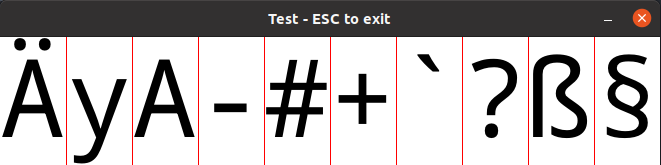

# noto-sans-mono-bitmap (Rust library)

Provides pre-rasterized characters from the "Noto Sans Mono" font in different sizes and font
weights for multiple unicode ranges. This crate is `no_std` and needs no allocations or floating
point operations. Useful in kernels and bootloaders when only "soft-float" is available. Strictly
speaking, this crate is more than a basic bitmap font, because it encodes each pixel as a byte
and not as a bit, which results in a much nicer result on the screen.

* Original font files taken from: <https://fonts.google.com/noto/specimen/Noto+Sans+Mono>
* License: SIL Open Font License (OFL) <https://scripts.sil.org/cms/scripts/page.php?site_id=nrsi&id=OFL>


## TL;DR
* ✅ `no_std`, zero allocations, no floating point operations
* ✅ most important symbols, numbers, and letters as pre-rasterized constant. Unicode-ranges are selectable.
* ✅ Noto Sans Mono font as base
* ✅ different sizes and font weights (light, normal, bold)
* ✅ nice anti-aliasing/smoothing and better looking than legacy bitmap fonts
* ✅ every pixel is encoded in a byte (0-255) and not a bit, which results in a much nicer result on the screen.
* ✅ relevant font sizes: 14, 16, 24, 32, and 64px (as optional build time features)
* ✅ zero dependencies
* ✅ All characters are aligned in their box/raster. If they are printed next to each other, the result looks nice.



## Developer Guide and Contributing
Please check [CONTRIBUTING.md](./CONTRIBUTING.md).

## Terminology: Is Bitmap Font The Right Term?
Legacy (8x8) bitmap fonts usually refer to a font where each symbol is encoded in 8 bits. The ones in a byte
(`0b00110000`) means "pixel on" and the zeroes' means "pixel off". However, my font actually encodes the
intensity of each pixel as a byte from 0 to 255. Hence, this is less size efficient than legacy bitmap fonts,
but looks much better. I still use the term bitmap font, because that term is used and known when talking
about pre-rasterized fonts/font rendering in low-level contexts, such as the boot process.

## When (Not) To Use This Crate
If you want to print to a framebuffer and if you develop a bootloader or a kernel, you usually don't
want to enable the FPU and refrain from floating point instruction (i.e. only use soft float).
My crate is a good option to print characters nicely to the screen in such scenarios. As nice live
font rendering of TTF fonts heavily relies on many floating point operations, which is not optimal
inside a low level binary. Legacy 8x8 bitmap fonts are ugly when printed to the screen.
`noto_sans_mono_bitmap` can be seen as a nice replacement with very nice anti-aliasing.

If you have a standard environment or support for floating point operations, you might want
to rasterize the font by yourself with the crate `fontdue` and some TTF fonts rather than
using my crate.

## Minimal Code Example
```rust
use noto_sans_mono_bitmap::{get_raster, get_raster_width, FontWeight, RasterHeight};

// Minimal example.
fn main() {
    let width = get_raster_width(FontWeight::Regular, RasterHeight::Size16);
    println!(
        "Each char of the mono-spaced font will be {}px in width if the font \
         weight={:?} and the bitmap height={}",
        width,
        FontWeight::Regular,
        RasterHeight::Size16.val()
    );
    let char_raster =
        get_raster('A', FontWeight::Regular, RasterHeight::Size16).expect("unsupported char");
    println!("{:?}", char_raster);
    for (row_i, row) in char_raster.bitmap().iter().enumerate() {
        for (col_i, pixel) in row.iter().enumerate() {
            println!("[{:02}][{:02}]: {:03}", row_i, col_i, pixel);
        }
    }
}
```

## Cargo Features and Crate Size
The `external/check-size` crate provides you with insights on the overhead of
having this library statically compiled into the binary.

By default, only a reasonable subset of possible features is included. The raw crate-size is a few
MiB in size but after compilation and discarding irrelevant parts (i.e., size 14, regular font,
only ASCII), the overhead should be at less than 120 KiB in binary size, according to my
measurements. However, even with the `all` feature, depending on your code, the
compiler can reliably discard unreachable or unused code paths. Nevertheless, it
is recommended to include no more features than necessary.

With all features included inside the binary, and without any discarding by the compiler, you
can expect 5 or more MiB of memory consumption. However, this would require the rather unlikely
case that you use different sizes and font weights simultaneously and all the unicode ranges.


## Quick Demo
`$ cargo run --example show_chars_in_window`

If you want to use special chars, such as `{ä, ö, ü, �}`, in the example,
you can use

`$ cargo run --example show_chars_in_window --features all`

## Limitations & FAQ
- _The replacement character `�` is cut off on the left and right._: \
   Yes and I can't do much about it. It seems as this symbol doesn't come from
   the font but from the rasterization library. However, I didn't spend too
   much time into the investigation. More details can be found on
   [GitHub](https://github.com/phip1611/noto-sans-mono-bitmap-rs/pull/17).
- _The line height is so high._ \
  Yes and I can't do anything about it. I get the line height from the TTF font
  and if I don't respect this value, certain characters will be cut off. I'm not
  an expert in font rendering. But for what it is, it is good enough.
  However, if you render the font into a framebuffer, you can cut of 1-2px on
  the top and one on the bottom, which should be fine for normal ASCII.

## Trivia
The rasterization was done with the awesome [fontdue-Crate](https://crates.io/crates/fontdue).
Thanks to the original author(s)!

## License
See LICENSE file in repository.

## MSRV (for library consumers)
Rust stable 1.56.1.
